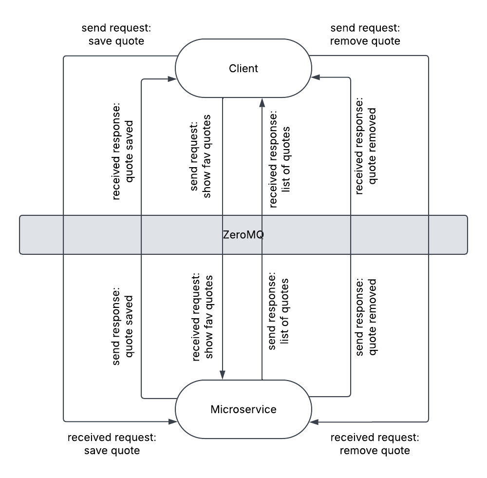

# Favorite Quotes Microservice

## Overview
This microservice provides a **ZeroMQ-based API** for managing favorite quotes. Users can:
- **Save a quote** to favorites.
- **Retrieve a list of favorite quotes**.
- **Remove a quote from favorites**.

This microservice communicates using **ZeroMQ REQ-REP pattern**, meaning each request **expects** a corresponding response.

---

## **Communication Contract**
**Set up ZeroMQ**
First of all, make sure you have ZeroMQ installed
```sh
pip3 install pyzmq 
```
or
```sh
pip install pyzmq
```

### **How to REQUEST Data from the Microservice**
All communication is done using **ZeroMQ**. To send a request, create a ZeroMQ `REQ` socket and send one of the following commands.

```python
import zmq
context = zmq.Context()
socket = context.socket(zmq.REQ)
socket.connect("tcp://localhost:5555") #using port 5555
```

#### **1. Save a Quote**
**Request format: `save:{quote}`**

the `save:` keyword tells the microservice to save the quote. All you have to do is to include `save:` and your input `quote` and send them via `socket.send_string()`. So the microserver will know that you want to save this quote. See code below for an example
```python
quote = "This is a quote" #this can be any quote generated by your program
socket.send_string(f"save:{quote}") #send the request
```
In the microservice `fav_quote.py`, after receiving the request with the string, it checks for keyword `save:` then perform the specific action `add_to_favorites()`
```python
message = socket.recv_string()
if message.startswith("save:"):
    quote = message.split("save:", 1)[1].strip()  #extract the quote
    response = add_to_favorites(quote)

```

#### **2. Retrieve Favorite Quotes**
**Request format: `view_fav`**

The `view_fav` keyword tells the microservice to retrieve a list of user's favorite quotes. All you have to do is to include `view_fav` in `socket.send_string()`. See code below for an exmaple
```python
socket.send_string("view_fav")
```
In the microservice `fav_quote.py`, after receiving the request `view_fav`, it performs the specific action `show_fav_quote()`
```python
message = socket.recv_string()
elif message == "view_fav":
    response = show_fav_quote()
```

#### **3. Remove a specific quote from favorite**
**Request format: `get:{quote_number}` AND `remove"{quote_number}`**

The `get` keyword tells the microservice to retrieve the quote number that is associated with the quote and `remove` tells the microservice to remove that quote. All you have to do is the have the keyword `get:` or `remove:` and the user selected `quote_number`, together send them via `socket.send_string()`. So the microserver will know that you want get this quote and remove it. For example:
```python
quote_number = input("\nEnter the number of the specific quote that you wish to remove from favorites: ")
socket.send_string(f"get:{quote_number}") #we send the quote number which user entered
socket.send_string(f"remove:{quote_number}") #we send the quote number which user want to remove
```
In the microservice `fav_quote.py`, after receiving the request with the keyword, for example `remove:`, it will take in the `quote_nuber` and call the function `remove_quote()` to remove based on the number it receives
```python
message = socket.recv_string()
elif message.startswith("remove:"):
    index = int(message.split("remove:", 1)[1].strip())
    response, _ = remove_quote(index)  #get both response message and removed quote
```


### **How to RECEIVE Data from the Microservice**
Since the microservice follows the ZeroMQ REQ-REP pattern, every request must have a corresponding response. The microservice will send back responses based on the type of request it receives.

#### **1. Save a Quote**
**Receive format: `response = socket.recv_string()`**

When a quote is saved, the microservice acknowledges it with a confirmation message. After sending the request, use `socket.recv_string()` to capture and print the response
```python
response = socket.recv_string() #should respond with Quote successfully saved!
print(response)
```
In the microservice `fav_quote.py`, the response is sent back via `socket.send_string()` after processing the request
```python
response = add_to_favorites(quote) #note that add_to_favorites() returns "Quote successfully saved!"
socket.send_string(response)
```

#### **2. Retrieve Favorite Quotes**
**Receive format: `response = socket.recv_string()`**

When requesting favorite quotes, the microservice responds with a formatted list of stored quotes. Capture the response and display it to the user with `socket.recv_string()`
```python
response = socket.recv_string() #should respond with a list of quotes
print(response) 
```
In the microservice `fav_quote.py`, the response is send back via `socket.send_string()` after processing the request
```python
response = show_fav_quote() #note that show_fav_quote() returns a list of quotes retrived from favorites.json
socket.send_string(response)
```

#### **3. Remove a specific quote from favorite**
**Receive format: `response = socket.recv_string()`**

To remove a quote, the microservice response with the specific quote number for removal
```python
response = socket.recv_string() #should respond with Successfully removed: {quote_number}!
print(response)
```
In the microservice `fav_quote.py`, the response is send back via `socket.send_string()` after processing the request
```python
response, _ = remove_quote(index)  #remove_quote() should both response message and removed quote
socket.send_string(response)
```


## UML Sequence Diagram

The following diagram illustrates how requesting and receiving data works between client and the microserver:

